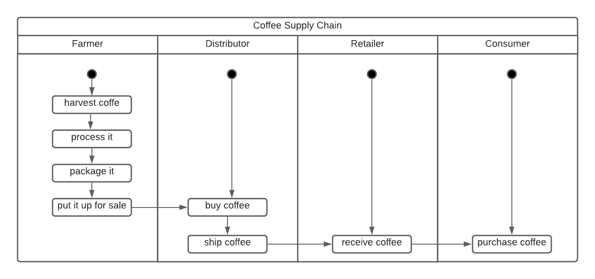
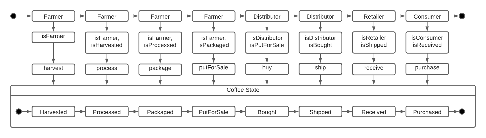
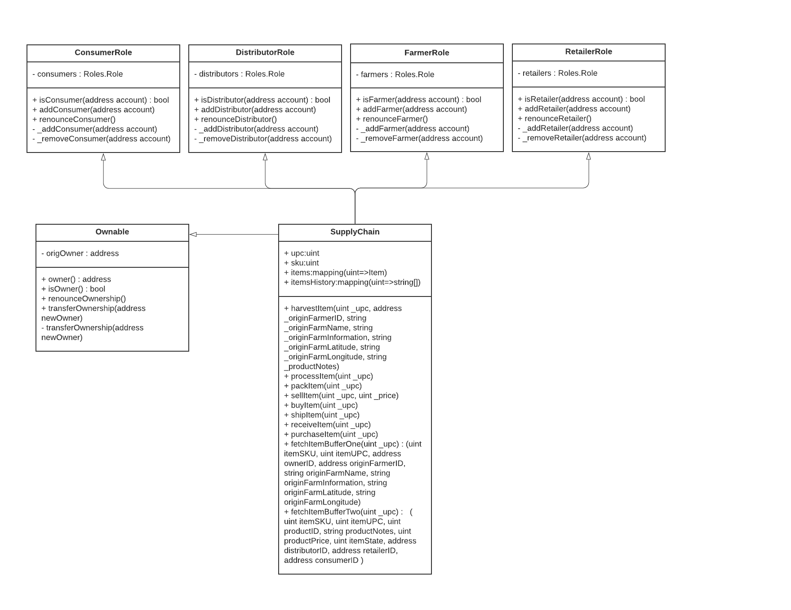
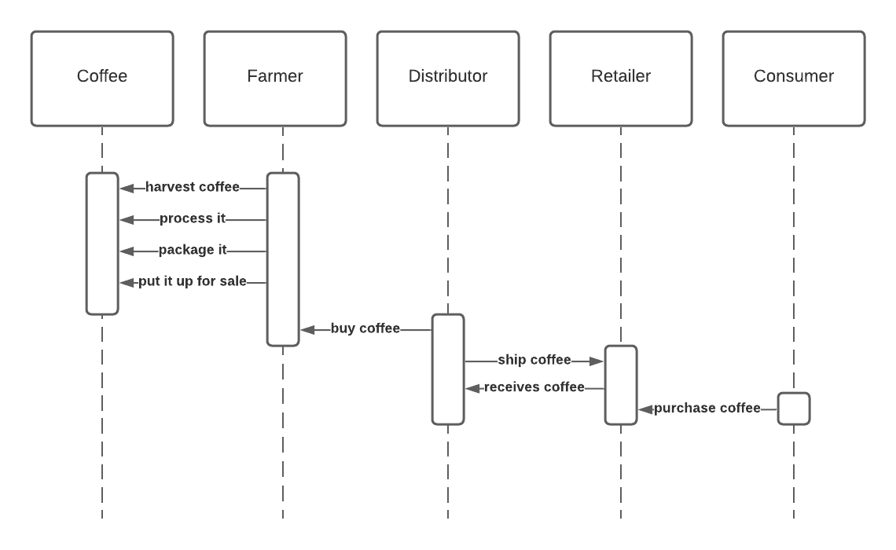
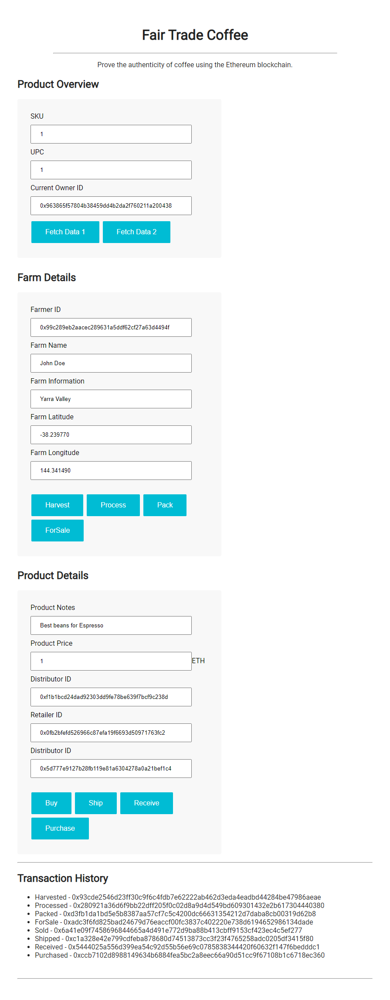

# Supply Chain

**Program**: Blockchain Developer Nanodegree Program

**Project**: Fair Trade Coffee Supply Chain

**Date**: 22th of May 2021

This Etherum DApp models a coffee supply chain with interaction between farmer, distributor, retailer and consumer.

---

Contract address on Rinkeby network:

- SupplyChain: `0xee03F6A7CFb97a953fF56DD7D75b30c644b7c8A2` @ [Etherscan](https://rinkeby.etherscan.io/address/0xee03F6A7CFb97a953fF56DD7D75b30c644b7c8A2)
- TxID: `0x5fc1884f7ee69a3081eea9b6de9ccf922c2b4bdd1087ec40ec6bcc4e1a5253e6`

---

## Tools

- `Etherum` decentralized platform for running smart contracts

- `Truffle` as a development environment to test and deploy contracts.

- `Metamask` browser extension providing wallet functionality to interact with DApp.

## Dependencies

Truffle Version: `v.5.2.0`

Solidity: `0.4.24`

Ganache CLI: `v6.12.2`

Node: `v14.16.0`

Web3.js `v.1.2.9`

## Setup

```bash
# smart contract
ganache-cli -m "spirit supply whale amount human item harsh scare congress discover talent hamster" # start ganache
truffle compile # compile contract to build\contracts
truffle migrate # deploy smart contracts
truffle test # run truffle tests

npm install @truffle/hdwallet-provider # dont forget to install to sign tx and then deploy via infura
truffle migrate --reset --network rinkeby # deploy to rinkeby network

# frontend
npm run dev # run webserver
```

## UML's:

### Activity Diagram

Depicts the flow of one activity to another in the system.



### State Diagram

Depicts how objects move through states within its lifetime.

 

### Class Diagram

Class diagram depicts data model.



### Sequence Diagram

Interaction in sequence in which they take place.



## Application Screenshot


